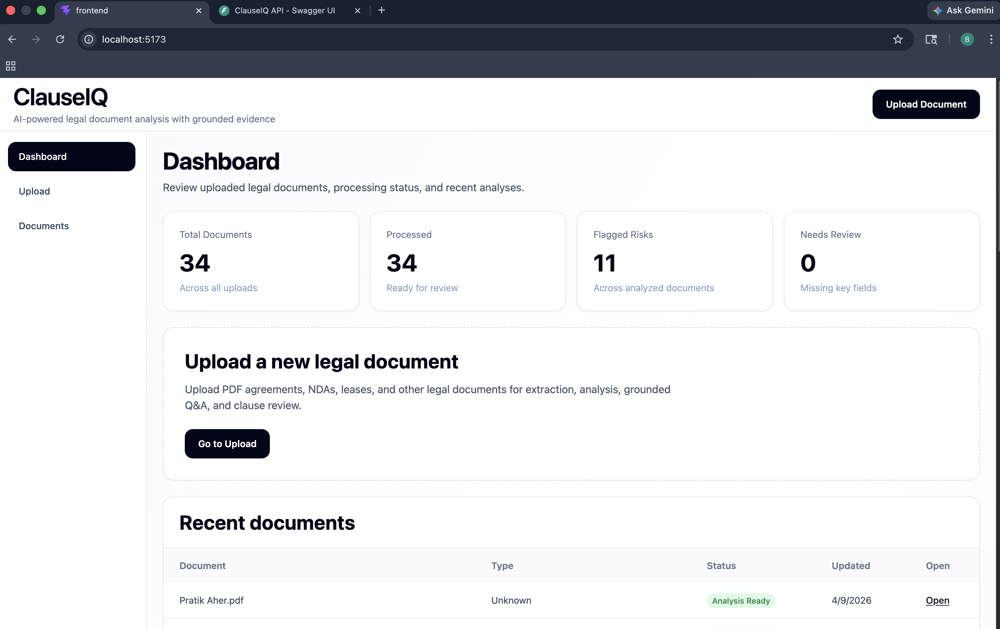
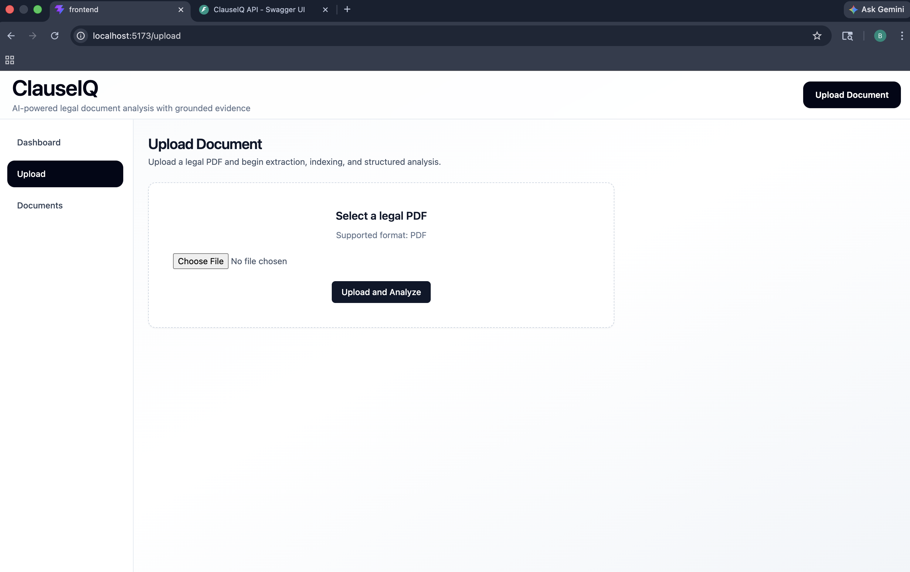
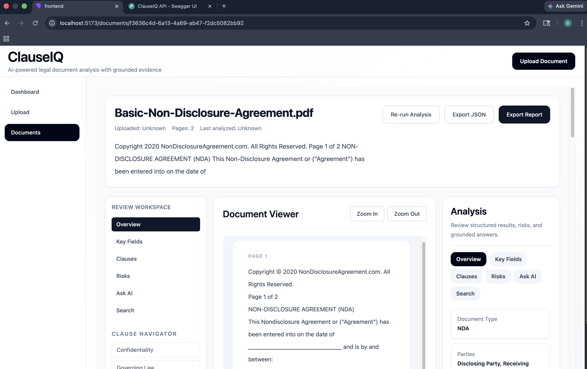
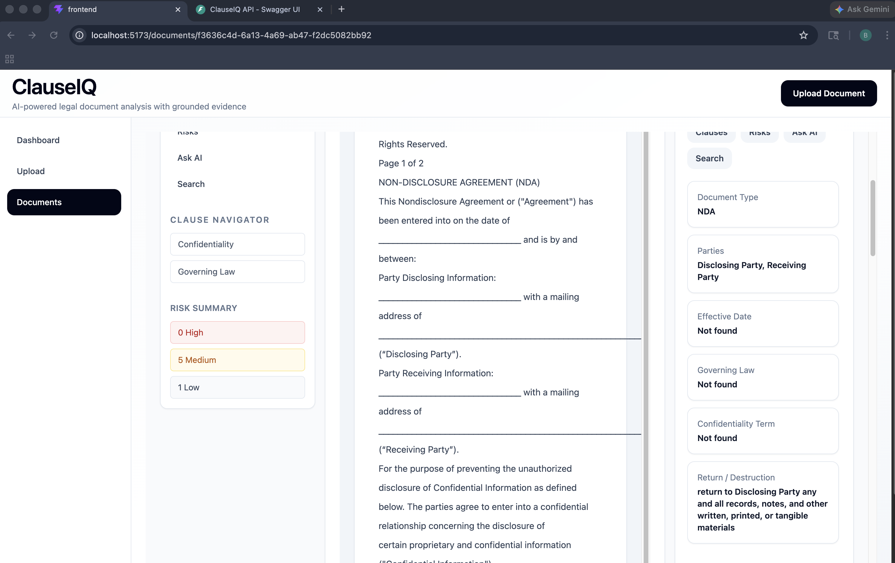
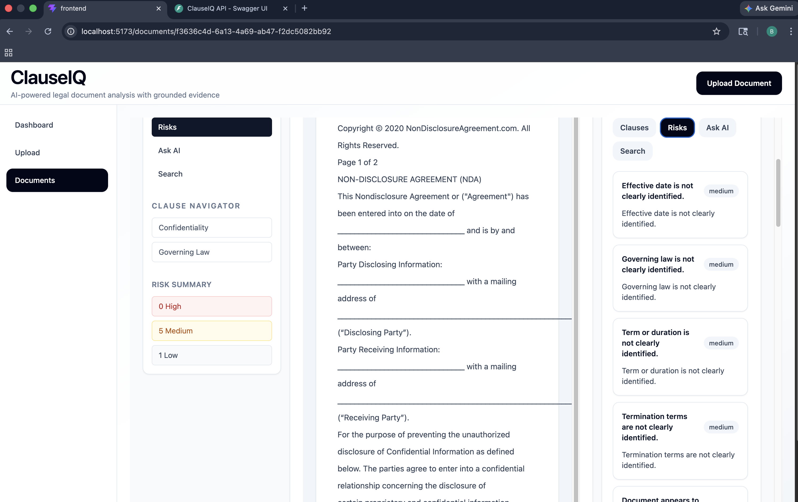
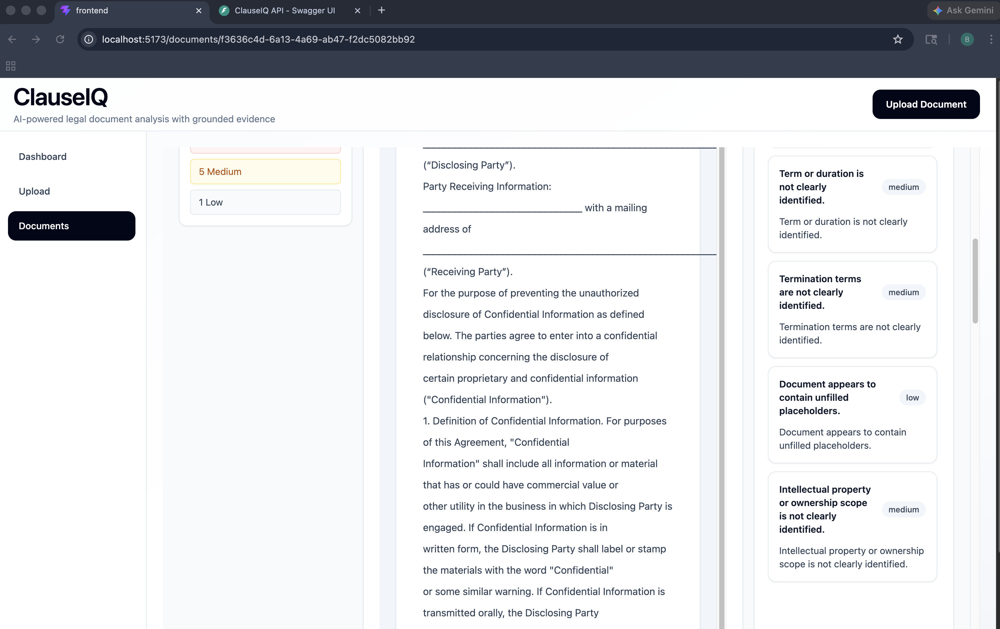

# ClauseIQ

ClauseIQ is a full-stack document intelligence system that analyzes legal and business documents using retrieval-augmented generation (RAG) and a locally hosted large language model.

It allows users to upload documents, extract key information, identify risks, and ask grounded questions with supporting evidence.

---

## Overview

ClauseIQ processes documents end-to-end:

- Extracts text from uploaded PDFs
- Breaks content into semantic chunks
- Generates embeddings for similarity search
- Retrieves relevant context using FAISS
- Uses a local LLM (Mistral via Ollama) to generate structured insights and answers

The system is designed to provide **traceable and explainable outputs**, rather than generic AI responses.

---

## Features

- **Document Upload & Parsing**
  - PDF ingestion with page-level extraction

- **Structured Analysis**
  - Document type detection
  - Party identification
  - Effective date extraction
  - Governing law and term detection

- **Clause & Risk Identification**
  - Highlights important clauses (confidentiality, termination, etc.)
  - Flags missing or unclear legal elements

- **Ask AI (RAG-based Q&A)**
  - Answers questions using retrieved document context
  - Returns supporting evidence with page references and confidence scores

- **Local LLM Integration**
  - Uses Mistral via Ollama (no external API calls)
  - Ensures data privacy and zero inference cost

---

## Tech Stack

**Backend**
- Python, FastAPI
- SentenceTransformers (`all-MiniLM-L6-v2`)
- FAISS (vector search)
- PyMuPDF (PDF parsing)
- Ollama (local LLM runtime with Mistral)

**Frontend**
- React (Vite)
- Tailwind CSS

---

## System Architecture

```text

Document Processing Pipeline
PDF → Text Extraction → Chunking → Embeddings → FAISS Index

Inference Pipeline:
                          Analysis Request
                                   ↓
                          Context Retrieval
                                   ↓
                         Mistral (via Ollama)
                                   ↓
               Structured Analysis with Grounded Answers & Evidence

```

## Setup Instructions

### 1. Clone the repository

```bash
git clone https://github.com/Aherpratik/ClauseIQ.git
cd ClauseIQ
```

### Backend Setup

```bash
cd backend
python -m venv venv
source venv/bin/activate
pip install -r requirements.txt
```

### Install and Run Ollama (Mistral)

```bash
brew install ollama
brew services start ollama
ollama run mistral
```
### Start Backend Server
```bash
uvicorn app.main:app --reload
```

- Backend runs at:
```

http://127.0.0.1:8000
```

### Frontend Setup

```bash
cd frontend
npm install
npm run dev
```

- Frontend runs at:

```
http://localhost:5173
```

---

##  API Endpoints

### Upload Document

POST /api/v1/upload


### Extract Document

GET /api/v1/extract/{document_id}


### Generate Summary

GET /api/v1/summary/{document_id}


### Structured analysis

GET /api/v1/analyze/{document_id}


### Ask question with evidence

POST /api/v1/ask

---

## Example Capabilities
- Identify parties in an agreement
- Extract effective dates and terms
- Detect missing governing law clauses
- Answer questions like:
  - "Who are the parties?"
  - "What is the termination clause?"
  - "What risks exist in this document?"

---

## Design Approach

The system combines:

- Rule-based extraction for reliability
- Vector search (FAISS) for semantic retrieval
- LLM reasoning (Mistral) for flexible understanding

A validation layer ensures outputs are normalized and consistent before being returned to the UI.
---

## Limitations
- Performance depends on document formatting quality
- Chunk-level retrieval may miss very fine-grained details
- Highlighting and exact span matching are approximate

## Future Improvements
- Better clause classification using fine-tuned models
- Improved highlighting and traceability
- Multi-document comparison
- Support for additional document formats

## Screenshots

### Dashboard


### Document Workspace


### Analysis Panel











